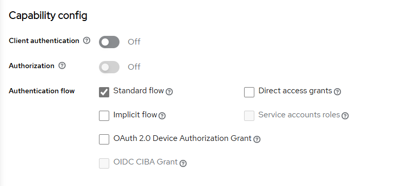

# MONOCLE
_Introduction_\
We developed, introduced, and evaluated MONOCLE (Molecular ONcology Optimized CLinical Evaluation), a secure, open-source web application at 
the University Medical Center Hamburg-Eppendorf (UKE), to optimize the analysis and discussion of complex cancer cases in molecular tumor boards (MTB).\
_Methods_\
MONOCLE standardizes and harmonizes documentation, while its integrated Knowledge Connector (KC) accelerates literature research for personalized treatment. 
The system was designed by merging the requirements of the German Network for Personalized Medicine (DNPM) and the medical staff involved in the MTB process. 
The usability was analyzed with the system usability scale (SUS) and user tasks.\
_Results_\
MONOCLE, introduced into clinical practice in June 2024, significantly reduces documentation and research time. Its usability and SUS showed positive results.
Conclusion
As the first open-source and extendable solution for standardized MTB documentation, MONOCLE enables wider adoption by other medical centers.


Our software consists of [MTB Backend ](#mtb-backend) and [MTB GUI/Frontend](#mtb-gui).

# MTB Backend

The MTB (MONOCLE) backend provides the API to read and save data regarding MTB patients.

## Services

### Internal services
`mtb-control and mtb-postgres`

### External services
```Mainzellist``` for pseudonymization (Env. variable: ML_XXX) \
**Note:** currently Mainzellist but will be replaced soon

`Keycloak` for authentication (Env. variable: KEYCLOAKAMDIN_XXX)

`Bwhc` from DNPN (Env. variable: BWHC_XXX)

**Note:** currently deactivated because will be replaced soon with Dnpm:Dip

## Installation

#### Folder Mounts
Create four folders to store the genetic files and MTB report. The folder names should be as follows:
* main
* unzip
* archive
* reports

Update the paths in the docker-compose file (volumes) to be the same locations where these folders are created.

#### Environment Variables

To provide environment variables using env file, copy the `example.env` file to your project directory and rename it to ```.env```.
Customize the variables inside the file, updating them with the desired values.

**Note** : If you are using docker (docker-compose up) and your env file is not inside the main directory, you need to change the
location of the env file.
change the env_file configuration in mtb-control service to:

```
env_file:
- ./file_path/.env
```

**Note** : If the environment variables are defined in the system, the values in the .env file will be overwritten.


# MTB GUI

This is the GUI for the MONOCLE project.
For further details, please refer to the [MTB GUI README](./frontend/README.md).

## Services

### Internal services

`mtb-gui`

### External services

`Keycloak` as an identity and access manager with openID protocol

## Installation

For authorization, you need a Keycloak server running. Please refer to following [documentation](https://www.keycloak.org/getting-started/getting-started-docker) if you need to set up one first.
Add a client with a standard flow authentication only, like this:


#### Environment Variables

Please copy the file [config.js.example](./config.js.example) to `config.js`.

# Docker
If everything is set up, you can run the following command to start the services:

```bash 
docker-compose up
```
or to run it in the background:
```bash 
docker-compose up -d
```
